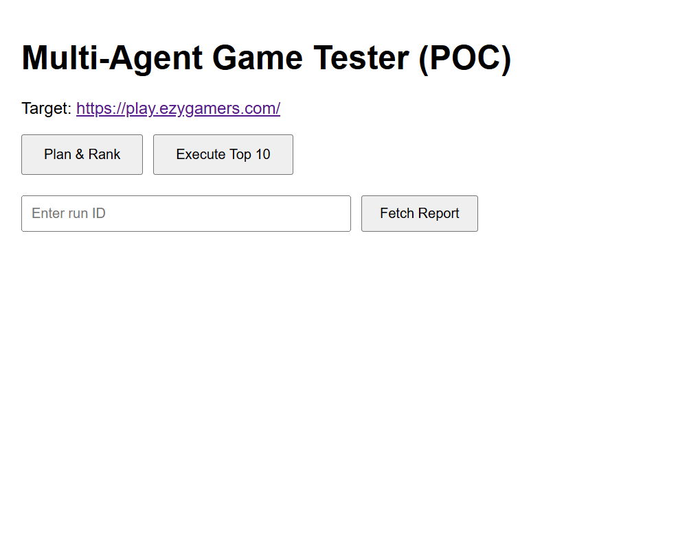
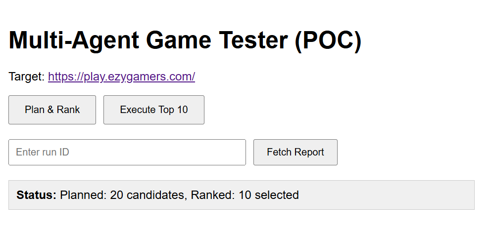
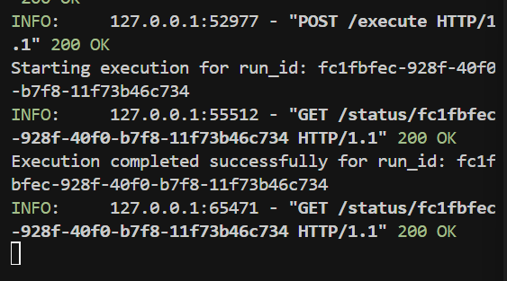
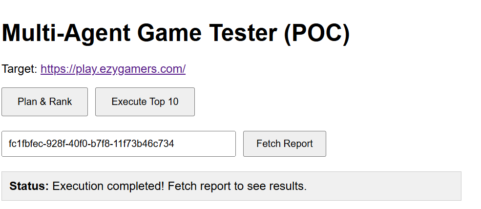
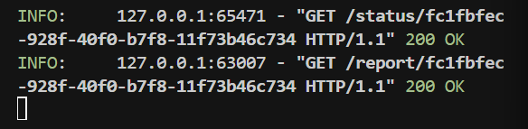
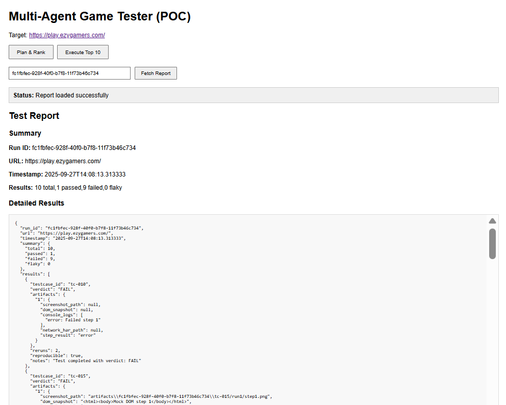
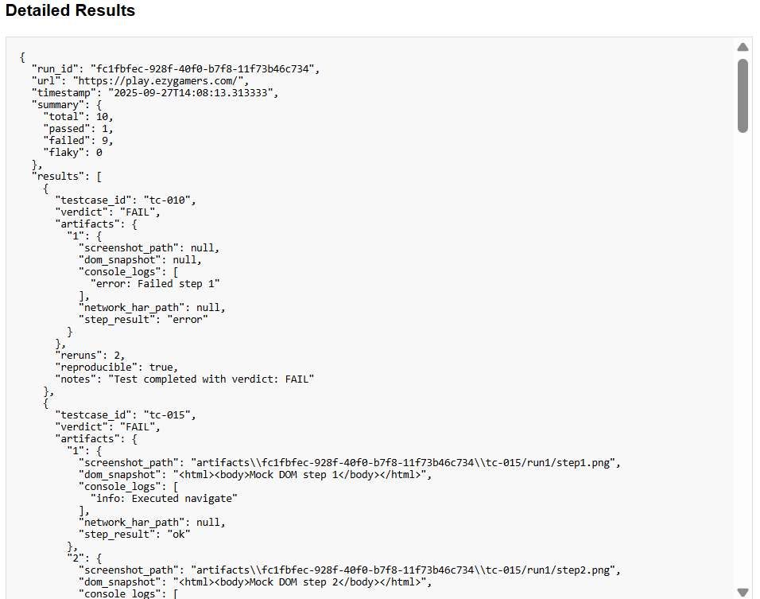
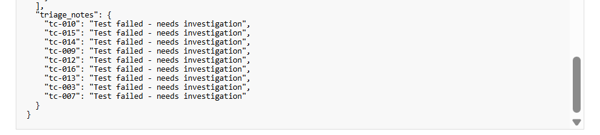

# Multi-Agent Game Tester with RAG Enhancement

An advanced multi-agent system for automated testing of web games using LangChain, FastAPI, Playwright, and RAG (Retrieval-Augmented Generation) for continuous learning and improvement.

## 🚀 Key Features

- **RAG-Enhanced Planning**: Uses vector embeddings and historical data for smarter test generation
- **Feedback Loop System**: Continuous learning from user feedback and test outcomes
- **Cross-Browser Validation**: Chrome and Firefox execution comparison
- **Performance Metrics**: Detailed analytics and improvement tracking
- **Vector Store**: ChromaDB integration for similarity search and learning
- **Feedback Database**: SQLite-based feedback collection and analysis

## Architecture

- **RAG Planner**: AI-powered test generation with historical context
- **Ranker Agent**: Scores and selects top test cases
- **Orchestrator**: Coordinates parallel execution across browsers
- **Executor Agents**: Chrome and Firefox test execution
- **Cross Validator**: Compares results across browsers
- **Analyzer Agent**: Result analysis and triage notes
- **Feedback Manager**: Continuous improvement system

## Quick Start

### Prerequisites
- Python 3.11+ (Required - Python 3.13 has compatibility issues)
- Node.js 18+
- Git
- OpenRouter API key (optional - has fallback)

### Setup Instructions

1. **Clone and setup:**
```bash
git clone https://github.com/yourusername/multi-agent-game-tester.git
cd multi-agent-game-tester

# Backend setup
cd backend
python -m venv venv
venv\Scripts\activate  # Windows
pip install -r requirements.txt
playwright install chromium firefox

# Initialize RAG system
cd ..
python init_rag.py
```

2. **Environment configuration:**
```bash
# Create .env file in root directory
echo OPENROUTER_API_KEY=your_key_here > .env
```

3. **Start services:**
```bash
# Backend (from backend directory)
uvicorn app.main:app --reload --port 8000

# Frontend (new terminal)
cd frontend
npm install && npm start

# Quick demo (optional)
python run_demo.py
```

4. **Access application:**
- Frontend UI: http://localhost:3000
- Backend API: http://localhost:8000
- API Docs: http://localhost:8000/docs

## API Endpoints

### Core Workflow
- `POST /plan` - RAG-enhanced test case generation
- `POST /rank` - Score and select top test cases
- `POST /execute` - Execute tests with cross-browser validation
- `GET /status/{run_id}` - Check execution progress
- `GET /report/{run_id}` - Get detailed execution report

### RAG & Learning System
- `POST /feedback` - Submit user feedback for test cases
- `GET /metrics/improvement` - Get improvement metrics over time
- `GET /metrics/learning` - Get learning insights
- `POST /retrain` - Trigger agent retraining
- `GET /rag/stats` - RAG system statistics
- `POST /rag/search` - Search similar test cases
- `GET /feedback/history` - View feedback history

### Example Usage

```bash
# 1. Generate RAG-enhanced test cases
curl -X POST http://localhost:8000/plan \
  -H "Content-Type: application/json" \
  -d '{"url": "https://play.ezygamers.com/", "goal": "find edge cases", "use_rag": true}'

# 2. Submit feedback for continuous learning
curl -X POST http://localhost:8000/feedback \
  -H "Content-Type: application/json" \
  -d '{"run_id": "uuid", "testcase_id": "tc-001", "score": 5, "comment": "Excellent test!"}'

# 3. Get improvement metrics
curl http://localhost:8000/metrics/improvement?days=30

# 4. Search similar test cases
curl -X POST http://localhost:8000/rag/search \
  -H "Content-Type: application/json" \
  -d '{"query": "division by zero test", "k": 5}'
```

## Enhanced Features

### RAG System
- **Vector Store**: ChromaDB for semantic similarity search
- **Feedback Database**: SQLite for performance tracking
- **Historical Context**: Learns from successful test patterns
- **Smart Generation**: Context-aware test case creation

### Cross-Browser Testing
- **Chrome Executor**: Primary test execution
- **Firefox Executor**: Cross-validation testing
- **Result Comparison**: Automated consistency checking
- **Browser-Specific Artifacts**: Separate artifact collection

### Continuous Learning
- **User Feedback**: 1-5 star rating system with comments
- **Performance Metrics**: Pass rates, reproducibility, feedback scores
- **Automatic Retraining**: Triggered by feedback thresholds
- **Learning Insights**: Trend analysis and recommendations

### Advanced Analytics
- **Improvement Reports**: Performance over time
- **Success Pattern Analysis**: What makes tests effective
- **Reproducibility Tracking**: Test stability metrics
- **Quality Scoring**: Multi-dimensional test evaluation

## Project Structure

```
multi-agent-game-tester/
├── backend/
│   ├── app/
│   │   ├── agents/
│   │   │   ├── planner.py          # Original LLM planner
│   │   │   ├── planner_rag.py      # RAG-enhanced planner
│   │   │   ├── ranker.py           # Test case ranking
│   │   │   ├── orchestrator.py     # Execution coordination
│   │   │   ├── executor.py         # Chrome test executor
│   │   │   ├── executor_firefox.py # Firefox test executor
│   │   │   ├── cross_validator.py  # Cross-browser validation
│   │   │   └── analyzer.py         # Result analysis
│   │   ├── rag/
│   │   │   ├── vector_store.py     # ChromaDB integration
│   │   │   ├── feedback_db.py      # SQLite feedback storage
│   │   │   └── feedback_loop.py    # Continuous improvement
│   │   ├── models.py               # Pydantic data models
│   │   ├── main.py                # FastAPI application
│   │   └── config.py              # Configuration
│   ├── artifacts/                  # Test execution artifacts
│   └── rag_data/                  # RAG system data
├── frontend/                       # React UI
├── infra/                         # Docker deployment
├── screenshots/                   # Demo screenshots
├── init_rag.py                   # RAG system initialization
├── run_demo.py                   # Quick demo script
└── README.md                     # This file
```

## Docker Deployment

```bash
cd infra
docker-compose up --build
```

## Advanced Usage

### Initialize RAG System
```bash
python init_rag.py
```

### Run Complete Demo
```bash
python run_demo.py
```

### Monitor Learning Progress
```bash
# Check improvement metrics
curl http://localhost:8000/metrics/improvement

# View learning insights
curl http://localhost:8000/metrics/learning

# Get RAG statistics
curl http://localhost:8000/rag/stats
```

## Test Artifacts

Each test execution captures:
- Screenshots per step (Chrome & Firefox)
- DOM snapshots
- Console logs
- Network activity (HAR files)
- Step-by-step results
- Cross-browser comparison data

## Target Application

Tests the math puzzle game at: https://play.ezygamers.com/

## Key Improvements Over Original

1. **RAG Enhancement**: Historical context improves test generation quality
2. **Feedback Loop**: Continuous learning from user input and outcomes
3. **Cross-Browser Support**: Chrome and Firefox validation
4. **Performance Analytics**: Detailed metrics and trend analysis
5. **Vector Search**: Semantic similarity for test case discovery
6. **Automated Learning**: Self-improving system through feedback
7. **Enhanced Artifacts**: Richer test execution data
8. **Better Reproducibility**: Improved test stability tracking

## Troubleshooting

### RAG System Issues
- **ChromaDB errors**: Ensure proper initialization with `python init_rag.py`
- **Vector store empty**: Run some tests first to populate data
- **Feedback not working**: Check SQLite database permissions

### Cross-Browser Issues
- **Firefox not installed**: Run `playwright install firefox`
- **Browser comparison fails**: Check both browsers are properly configured
- **Artifacts missing**: Verify write permissions in artifacts directory

### Performance Issues
- **Slow test generation**: Disable RAG with `"use_rag": false` in /plan request
- **Memory usage**: Clear vector store periodically with `/rag/clear-data`
- **Database growth**: Archive old feedback data regularly

### Common Issues
1. **Python 3.13 + Playwright issues**: Use Python 3.11 or add `asyncio.set_event_loop_policy(asyncio.WindowsProactorEventLoopPolicy())`
2. **LangChain import errors**: Use `langchain_openai` instead of deprecated modules
3. **Frontend connection issues**: Ensure backend runs on port 8000 with CORS enabled

## Development Notes

This enhanced version demonstrates:
- **RAG-powered AI testing** ✅
- **Continuous learning system** ✅
- **Cross-browser validation** ✅
- **Performance analytics** ✅
- **Vector similarity search** ✅
- **Automated improvement** ✅

The system now learns from every test execution and user feedback, continuously improving test quality and relevance through advanced ML techniques.

## Demo Screenshots

### Project Overview


### Step 1: Planning and Ranking



### Step 2: Test Execution



### Step 3: Results and Reports






This project is a proof-of-concept for educational and research purposes.